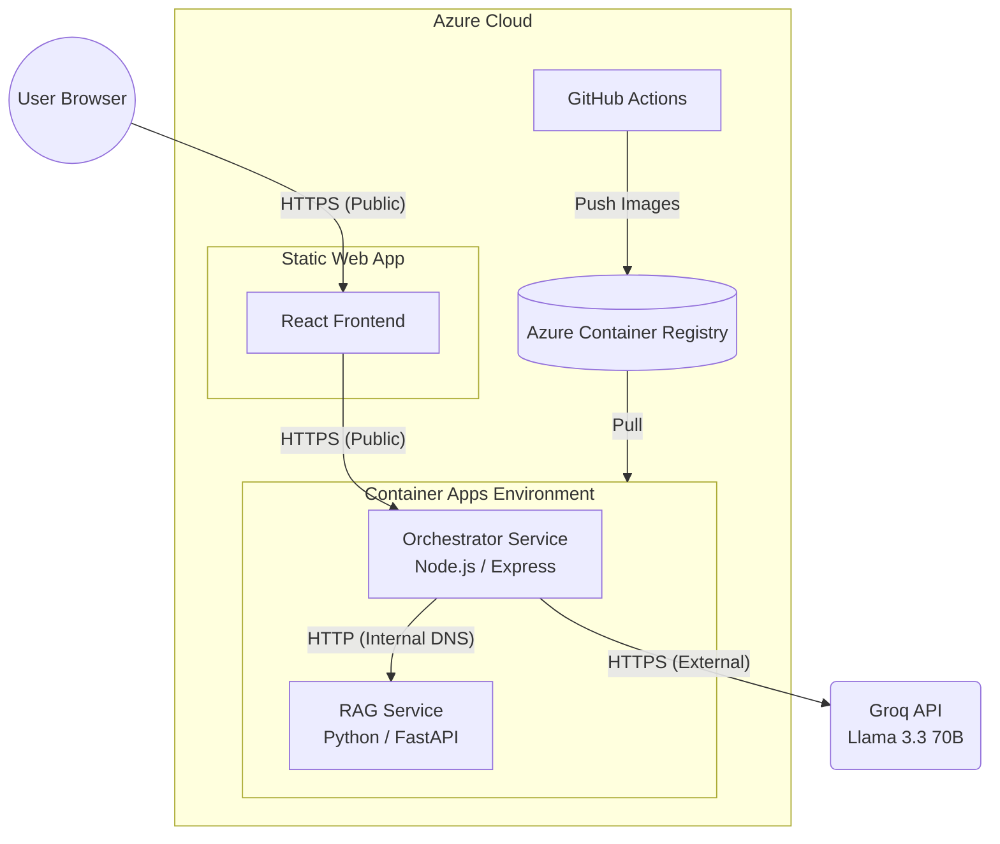

# DeskMate — Production Architecture (Azure)

This document outlines the production architecture for DeskMate deployed on **Microsoft Azure**.

## 🌐 Architecture Diagram

## 🚀 Component Breakdown

### 1. Frontend (Azure Static Web App)
- **Technology**: React + Vite + TypeScript.
- **Hosting**: Globally distributed via Azure Static Web Apps.
- **Configuration**: `VITE_API_URL` is injected during the GitHub Actions build process to point to the Orchestrator's ACA endpoint.

### 2. Orchestrator (Azure Container App)
- **Technology**: Node.js 18 + Express + TypeScript.
- **Port**: Hardcoded to `3001` to match Azure's ingress configuration.
- **Role**: Handles intent parsing, tool execution (mocked), and LLM response synthesis.
- **Secret Management**: `GROQ_API_KEY` is stored as an Azure Container App secret and injected as an environment variable.

### 3. RAG Service (Azure Container App - Internal)
- **Technology**: Python 3.10 + FastAPI + NumPy.
- **Ingress**: Internal (only accessible within the ACA Environment).
- **Knowledge Base**: `IT_Handbook.txt` is bundled directly into the Docker image at `/app/data/IT_Handbook.txt` for zero-latency auto-ingestion on startup.
- **Vector Search**: Uses NumPy brute-force cosine similarity for portability and speed at small scales.

## 🛡️ Networking & Security

- **Environment Isolation**: The Orchestrator and RAG services reside in the same **Container Apps Environment**, sharing an internal virtual network.
- **Internal Only Backends**: The RAG service has no public IP address; it is reached via internal DNS at `rag-service.internal.[env-id].[region].azurecontainerapps.io`.
- **CORS Policy**: Configured on the Orchestrator to only allow traffic from the Static Web App domain and local development ports.

## 📦 Deployment Strategy

1. **Source Control**: GitHub repository `anantrajjj/DeskMate`.
2. **CI/CD**: GitHub Actions.
   - **Frontend**: `azure-static-web-apps-jolly-coast-0d2add31e.yml`
   - **Backends**: Continuous Deployment linked via **Azure Container Registry (ACR)**.
3. **Containerization**: 
   - Uses multi-stage Docker builds for optimized image sizes.
   - Build context is forced to the root to allow cross-module file sharing (like bundling the handbook).

## 📈 Scalability & Maintenance

- **Horizontal Scaling**: Both backends support horizontal scaling (min/max replicas) based on CPU/Memory pressure or HTTP request volume.
- **Zero-Downtime Deploys**: Azure Container Apps uses "Revisions" to perform blue-green deployments by default.
- **Monitoring**: Logs are streamed to **Azure Log Analytics** for centralized debugging.
